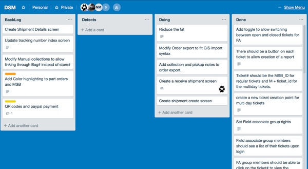

## Description

We make a big deal about "Teach One Another" here. This often gets implemented as group work. This is not a bad thing, no matter how you personally may feel about it. Turns out most jobs **will** require you to work with others.

Teachers often make too many assumptions however about how much our students know about *how* to work in a group. Here are a few tips and tricks to help you out with group projects.

## Where this knowledge is utilized

- Just about everywhere 😀

## Common Issues with Groups

The following are common complaints I hear from students about working in groups:

1. It's too hard to coordinate schedules
2. Not everyone in the group contributes evenly
3. I'm never sure what I should be doing
4. It's too hard to keep everyone in the group on the same page and doing the right thing at the right time
   Do you notice the common thread? Successful group work really comes down to how well you **communicate** with each other.

Here are a few tips and tools you can use to help.

## Tips and Tools

To be honest, in a school group project, schedule coordination is probably the hardest thing to accomplish. In a work environment (what we are trying to emulate with group work), you have the advantage that everyone is expected to be around and somewhat available M-F, 8-5. That is not the case in school.

Unfortunately, the only advice I can offer here is that when you are in a group you will have to make it a priority. Make time wherever you can so that you don't let your group down. But you can try and minimize the amount of time you all need to be together at once. Try to make your group function as asynchronously as you can.

In order to do that, you will need a few things:

1. A good communication plan (how and how often)
2. A good way of tracking and assigning tasks
3. A way to avoid stepping on each others toes when working on similar areas of the project

Here are a few tools that the pros use to accomplish those things:

1. Communication plans deal with two very important things: how a team will communicate, and how often a team member is expected to check in and give a report.

   On regular intervals your group should be checking in with each other to give progress updates. These meetings should be very quick. While they would be synchronous in the ideal setting, they can certainly be accomplished asynchronously as well.

   The first time your team meets you should decide how often you will touch base. A project with a tight short deadline might have an expectation of daily communication, while a longer project might have one or two checkins a week. The important part is that the expectation is set early and all team members are aware of it.

   After the frequency is set the next part is the method. Small teams could make this as simple as a group text, while larger teams might opt for something more robust. Most professionals use a tool like Slack or Microsoft Teams these days. [Slack](https://slack.com) is an online communication tool that is easy to setup and free to use. Microsoft Teams is another great alternative. It is very similar Slack and all students at the University have an account.

   The checkins will be most effective if they are kept short! In these meetings members usually report: What I've done since I last reported, what I am planning on doing next, and if I'm stuck on anything.

2. Tracking and assigning tasks:

   [Trello](https://trello.com/): I'm a big fan of Trello for tracking tasks. This is another free tool that you should take advantage of in your groups. Create a board with a minimum of the following lists: Backlog, Defects, Doing, and Done, then invite all the members of your group to the board. Other options could be Jira or even Github Issues.

   
   Example of a Trello project board.

   At the beginning of the project the group's first job is to get together and fill out the Backlog list. This initial list building REALLY needs to be done synchronously (an 'all hands on deck' meeting). Every single task should be broken into as small of pieces as makes sense, and entered in there. A good benchmark is that most tasks should take less than 30 minutes to complete. If you end up with any cards that you think will take longer than 30 minutes...split them up.

   Anytime someone thinks of something else that needs to be done it should immediately be added to the backlog list.

   Then whenever a member has time to work on the project, they can login to Trello, put their face on a card (assign the card to themselves), and move it into Doing. This way you can always see who is working on what, and what still needs to be done.

   Make sure to move your tasks to Done when you finish them!

   One really nice side effect of working this way is at the end of the project there is no question about who did what...or who did nothing.

3. [GitHub](https://github.com/): Every successful team needs a way to share what they have done with each other. GitHub is one popular way to do that (Bitbucket is another popular alternative). These tools track changes, which is awesome for groups. They do take a bit of effort to learn how to use effectively, but it is totally worth it! If you do a search you will find many free resources to help you master them. (Two topics to give special attention to would be merging conflicts and ignoring files.)

   One other suggestion for managing code would be to break it down into small pieces. Spread your code across many small files with each accomplishing one thing, instead of trying to get everything together in one large, hard to maintain file. This also helps you to avoid having conflicts on committed code.

## Putting it Together

Let's look at an example of how this might look on any given day for a member of a group if you setup your project with these tools (or something similar):

1. Login to Slack or Teams and see what updates there are from team members.
2. Open Trello and look over the Backlog and the Doing lists.
3. Assign myself to a new task and move it to Doing.
4. Make sure to "Pull" from the code repository (either GitHub or Bitbucket) to get any changes my teammates might have finished *before* you start your work. **This is really important!!!**
5. If you are using [branches](https://docs.github.com/en/pull-requests/collaborating-with-pull-requests/proposing-changes-to-your-work-with-pull-requests/about-branches) in your workflow, create a new branch for your work.
6. Open my editor and complete the Task I grabbed. (Complete means coded AND tested! Make sure you didn't break anything with your changes!)
7. "Commit" and "Push" my code back up to the Repository for my teammates. If you are using a branch then make a [pull request](https://docs.github.com/en/pull-requests/collaborating-with-pull-requests/proposing-changes-to-your-work-with-pull-requests/about-pull-requests). If there are any merge conflicts resolve them. You can do this by opening up the file which had the conflict and find the sections delineated with the conflict markers: `<<<<<<<, =======, >>>>>>>`  Decide which code to keep (often this is by combining the conflicting code), delete the markers.
8. Move the task I just finished in Trello over to Done.
9. Make any updates to Slack or Teams that your group might need to know about what you did.

## Wrapping Up

Two thoughts in closing: first, these tips and tools will make the biggest difference in group projects that must be completed and turned in as a group, but they can also be applied with success in learning groups. Second, these are not the only tools available to solve these problems...and none of them are required to use. But adopting them or something like them in your group project workflows can make a huge difference on your success and enjoyment in working in groups!
